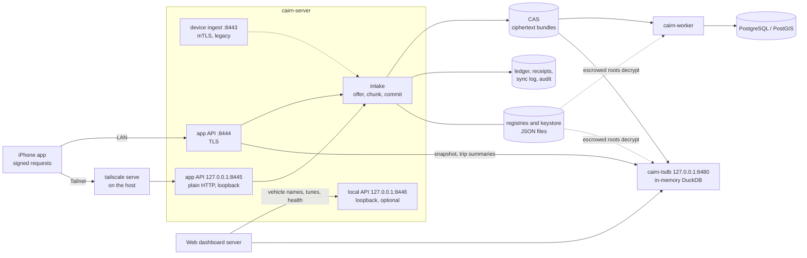
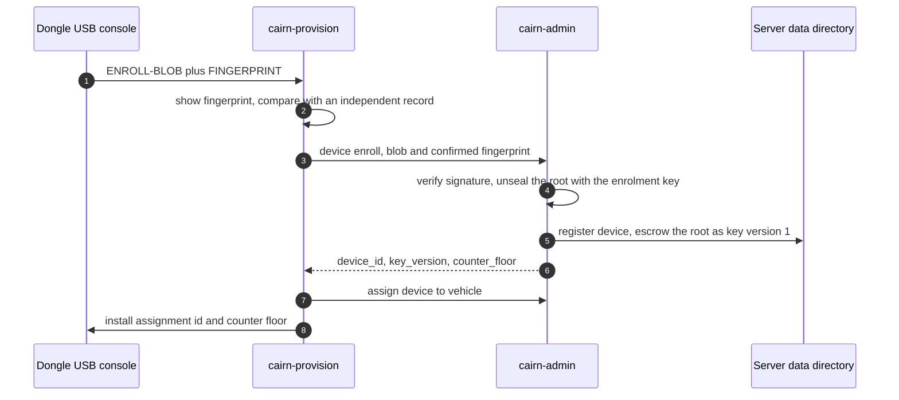
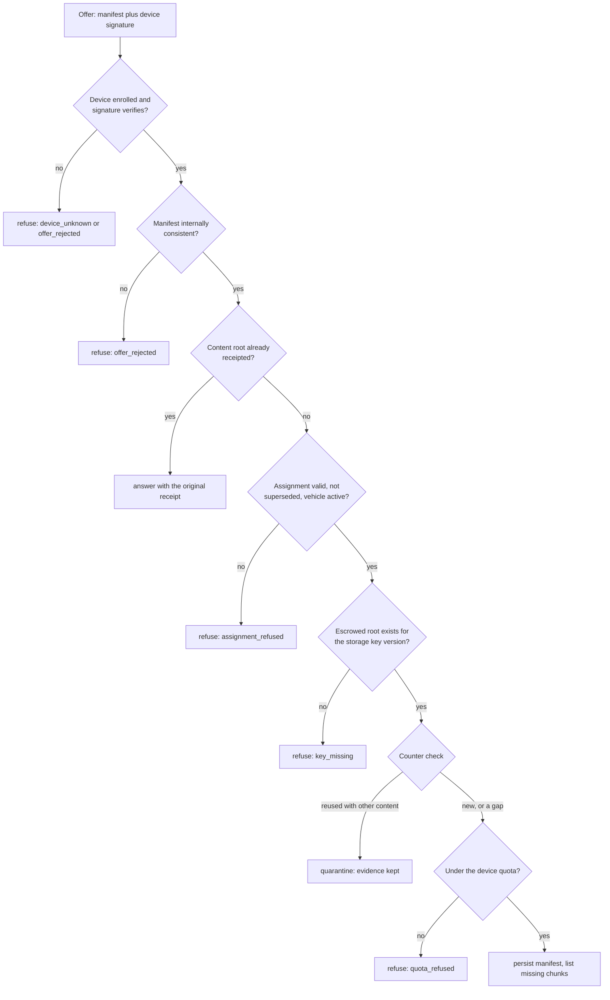
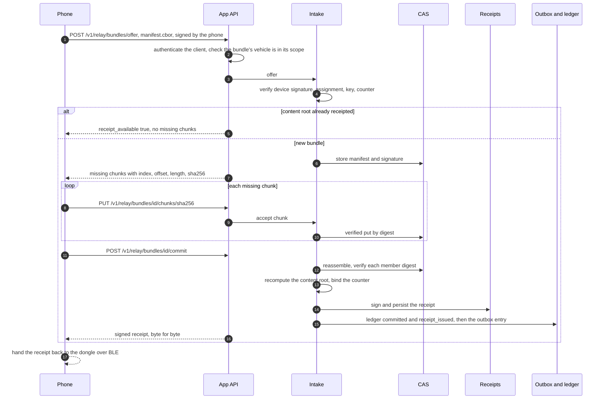
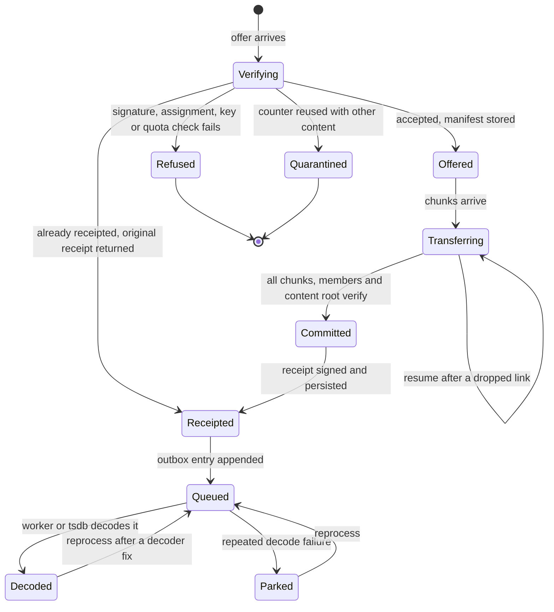
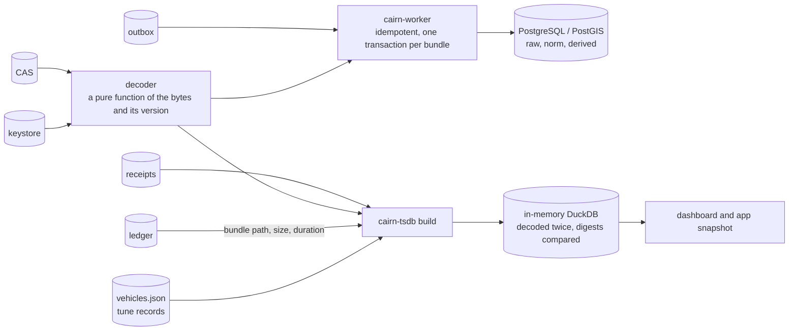
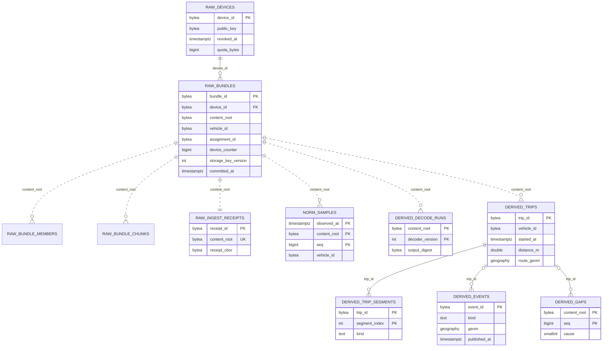

<!-- cairn-nav:start -->
<p align="center"><b>Cairn is a family of six repositories.</b> Each builds, tests and releases on its own; they agree through the shared <a href="https://github.com/ParkWardRR/cairn-driving-log-selfhosted/tree/main/contracts">contracts</a>, and they share one <a href="https://github.com/ParkWardRR/cairn-driving-log-selfhosted/blob/main/ROADMAP.md">roadmap</a>.</p>

| Part | Repository | What it does | Stack | Docs | Issues | CI |
|---|---|---|---|---|---|---|
| Front door | [cairn-driving-log-selfhosted](https://github.com/ParkWardRR/cairn-driving-log-selfhosted) | Docs, roadmap, shared protocol contracts | Markdown · Go tools | [docs](https://github.com/ParkWardRR/cairn-driving-log-selfhosted/tree/main/docs) | [issues](https://github.com/ParkWardRR/cairn-driving-log-selfhosted/issues) | [CI](https://github.com/ParkWardRR/cairn-driving-log-selfhosted/actions) |
| Dongle | [cairn-esp32-device-firmware](https://github.com/ParkWardRR/cairn-esp32-device-firmware) | In-car recorder: OBD-II, GNSS, IMU to encrypted SD bundles | C++ · C · Rust | [docs](https://github.com/ParkWardRR/cairn-esp32-device-firmware/tree/main/docs) | [issues](https://github.com/ParkWardRR/cairn-esp32-device-firmware/issues) | [CI](https://github.com/ParkWardRR/cairn-esp32-device-firmware/actions) |
| Phone | [cairn-ios-companion-app](https://github.com/ParkWardRR/cairn-ios-companion-app) | BLE relay, GPS assist, server client | Swift · SwiftUI | [docs](https://github.com/ParkWardRR/cairn-ios-companion-app/tree/main/docs) | [issues](https://github.com/ParkWardRR/cairn-ios-companion-app/issues) | [CI](https://github.com/ParkWardRR/cairn-ios-companion-app/actions) |
| Server | **[cairn-vehicle-server](https://github.com/ParkWardRR/cairn-vehicle-server)** ◀ you are here | Verifies, decrypts, stores; serves app and dashboard | Go | [docs](https://github.com/ParkWardRR/cairn-vehicle-server/tree/main/docs) | [issues](https://github.com/ParkWardRR/cairn-vehicle-server/issues) | [CI](https://github.com/ParkWardRR/cairn-vehicle-server/actions) |
| Dashboard | [cairn-vehicle-web-dashboard](https://github.com/ParkWardRR/cairn-vehicle-web-dashboard) | Browser UI: trips, places, engine, health | Nuxt · TypeScript | [docs](https://github.com/ParkWardRR/cairn-vehicle-web-dashboard/tree/main/docs) | [issues](https://github.com/ParkWardRR/cairn-vehicle-web-dashboard/issues) | [CI](https://github.com/ParkWardRR/cairn-vehicle-web-dashboard/actions) |
| Modules | [cairn-modules](https://github.com/ParkWardRR/cairn-modules) | Interpretation, separated from the logging core: one package per module | YAML · Rust | [readme](https://github.com/ParkWardRR/cairn-modules#readme) | [issues](https://github.com/ParkWardRR/cairn-modules/issues) | [CI](https://github.com/ParkWardRR/cairn-modules/actions) |

<sub>Shared: [Roadmap](https://github.com/ParkWardRR/cairn-driving-log-selfhosted/blob/main/ROADMAP.md) · [Install](https://github.com/ParkWardRR/cairn-driving-log-selfhosted/blob/main/INSTALL.md) · [Architecture](https://github.com/ParkWardRR/cairn-driving-log-selfhosted/blob/main/docs/architecture.md) · [Threat model](https://github.com/ParkWardRR/cairn-driving-log-selfhosted/blob/main/docs/threat-model.md) · [Trust model](https://github.com/ParkWardRR/cairn-driving-log-selfhosted/blob/main/docs/trust-model-v3.md) · [Contracts](https://github.com/ParkWardRR/cairn-driving-log-selfhosted/tree/main/contracts) · [Archive of the original monorepo](https://github.com/ParkWardRR/cairn-original-monorepo-archive)</sub>
<!-- cairn-nav:end -->
<h1 align="center">Cairn vehicle server</h1>
<p align="center"><strong>The part of Cairn that you run at home: it receives, verifies, stores and explains your car's drives.</strong></p>

<p align="center">
  <a href="https://blueoakcouncil.org/license/1.0.0"></a>
  <a href="https://github.com/ParkWardRR/cairn-vehicle-server/actions/workflows/ci.yml"></a>
  
  
</p>

---

## What this is

[Cairn](https://github.com/ParkWardRR/cairn-driving-log-selfhosted) is a driving log for your own car. A small device
in the car's diagnostic port records every drive, your iPhone carries those recordings home, and **this server** is where
they land. It checks that each recording is genuine and complete, keeps it, turns it into trips and engine statistics,
and answers the iPhone app and the web dashboard.

You run it yourself, on one small machine (a spare mini PC or a Raspberry Pi class computer is enough). There is no
account, no subscription and no cloud service in the path. If you stop using Cairn, your data is in files you already own.

**Why self-hosted?** A car journal is location history. Cairn is built so that the people who could read it are you and
no one else:

- The recorder encrypts every drive on its own SD card. A copied card is ciphertext.
- The phone that carries a recording **cannot read it**. It relays encrypted bytes and hands back a receipt.
- This server is the one place that holds the keys to decode a trip, and it lives on your network. Remote access is over
  your own Tailscale network, never a public address.
- Everything the server shows you is *derived* from the encrypted recordings it keeps, and can be rebuilt from them.

This repository is the server. The other parts are listed under [Related repositories](#related-repositories).

## Status at a glance

Honest status, as of **2026-10-08**. "Deployed" is taken from the project's single
[roadmap](https://github.com/ParkWardRR/cairn-driving-log-selfhosted/blob/main/ROADMAP.md#where-cairn-is-today);
this repository cannot verify a live host by itself.

> **Where this is going** is not in this README. The project keeps one roadmap, for all six
> repositories. This server's next work is
> [Phase 28](https://github.com/ParkWardRR/cairn-driving-log-selfhosted/blob/main/ROADMAP.md#phase-28--the-networked-dongle-finished--in-progress)
> (a device uplink endpoint and a sealed configuration service, then retiring the legacy `:8443`
> listener), the
> [module system's M3 remainder](https://github.com/ParkWardRR/cairn-driving-log-selfhosted/blob/main/ROADMAP.md#m1m7--the-module-system--in-progress)
> (module views, `v_metric_samples`, named queries) and
> [Phase 30](https://github.com/ParkWardRR/cairn-driving-log-selfhosted/blob/main/ROADMAP.md#phase-30--insight-history-health-and-engine-aware-views--in-progress)
> (a tune record, baselines and a health summary).

| Area | State | Notes |
|---|---|---|
| Bundle intake: manifest-first, hash-addressed, resumable, receipts | **Shipped, tested, deployed** | Same rules on every path. Crash recovery and a firmware interop run are required CI jobs |
| App API (`sync/v1`): signed requests, enrolment, push/pull, snapshot, bundle relay | **Shipped, host-tested, deployed** | The contract is **draft**: this server implements it, the iPhone app does not yet use all of it |
| Device ingest over mutual TLS (`:8443`) | **Legacy, still deployed** | No dongle uses it. Retired once the phone relay is proven on hardware (front-door issue 7). It cannot be turned off by a flag today |
| Escrowed storage roots, counters, assignments, revocation | **Shipped, tested** | Crypto-shredding exists as a library call; **no command exposes it yet** |
| `cairn-tsdb` analytical store (in-memory DuckDB) | **Shipped, deployed** | Rebuilt from the raw bundles on every start; refuses to serve if the rebuild does not reproduce |
| PostgreSQL/PostGIS decode (`cairn-worker`) | **Built and tested in CI; not installed by `deploy-v3.sh`** | No systemd unit is shipped. The dashboard reads `cairn-tsdb`, not PostgreSQL |
| `store/v1` views, tune records, engine profiles, health summary, bundle paths | **Shipped, tested** | Store contract `store/v1.3`; see [below](#analytical-store-storev1) |
| Real hardware, end to end | **Verified 2026-10-06, and real trips since** | The dongle, `cmd/cairn-phone` on macOS, this server's relay, `cairn-tsdb` and the dashboard talked to each other for the first time: nine bundles over BLE in 62 s, nine committed via `/v1/relay/bundles/*`, nine receipts signed, and the dongle verified each against the pinned key and pruned. The ledger records all nine as `offered → committed → receipt_issued → decode_queued`, `"path":"ble-relay"`. One `counter_gap` is in there (counter 8 skipped seven values past the high-water mark): logged, committed anyway, worth understanding. The firmware ran a dev-pairing build (Just Works, no MITM) — see the firmware README's "Pairing and access" caveat |
| Trips the dongle uploaded **itself** | **Accepted, on the legacy listener** | Since 2026-10-07 the dongle delivers bundles over Wi-Fi mTLS and over LTE through a Tailscale Funnel ingress, and prunes on this server's receipts. It does so through the **legacy** `:8443` device listener, not through `uplink/v1` — so the listener cannot be retired until the replacement endpoint exists (server issue 21) |
| Device uplink endpoint (`uplink/v1`) | **Designed, not implemented** | The contract is draft with 15 vectors. Writing it is what lets `:8443` and the device certificates go away (server issue 21) |
| Modules (`module/v1`): module-owned derived columns | **Shipped, tested** | `internal/modules` loads and validates a module set at runtime (`cairn-tsdb -modules`), resolves its requirements against the live catalogue and orders derivations topologically, refusing a cycle; `applyDerivations` runs them after the rows load and before the views. `boost` owns `boost.boost_psi`. A module set that will not load is **fatal**, because a module owns a column's definition. Module **views**, metrics and named queries are not implemented yet |
| LTE digests (provisional trips, usage accounting) | **Planned** | Server issue 25 |
| Sealed device configuration (Wi-Fi and LTE settings sent to the dongle) | **Planned** | Server issue 24 |
| v2 to v3 data migration | **Planned** | Wanted by the owner (server issue 18). No migration code exists. [MIGRATION.md](MIGRATION.md) is about this repository's *history*, not about data |
| Passkey sign-in | **Not in this repository, by design** | Passkeys and Tailnet identity are both supported by the [web dashboard](https://github.com/ParkWardRR/cairn-vehicle-web-dashboard/blob/main/docs/auth.md); see [Who can do what](#who-can-do-what-passkeys-and-tailnet-identity) |

**Hardware constraint worth knowing.** There is exactly one real dongle, an ESP32 revision v1.0 part. ESP32 Secure Boot V2
needs revision v3.0 or later, so it is **not available** on that unit, and no eFuse is burned without a spare unit — which
means flash and NVS encryption are **not** coming to this dongle, and the network credentials it now holds are in plaintext
flash. What that costs is bounded: a flash dump yields the device's client key, which permits uploading **as** that device
and reading what it uploads. It does **not** permit deleting anything, because a prune requires a receipt this server
signed and the dongle verified. What protects the server from a stolen dongle is therefore revocation here, which takes
effect on the next request. None of that changes how this server behaves.

**One PKI fact that blocks work here.** The `Cairn Private CA` private key does not exist on the host or anywhere else, so
no new device client certificate can be issued, and `server.pem`'s SAN covers the LAN name only. Regenerating the PKI is
low risk — no client certificate was ever issued and the firmware pins no CA — and whatever replaces it needs both the LAN
name and the Funnel name. Until then the cellular path depends on Funnel and TLS terminates on the ESP32.

## What is in the box

| Command | What it does |
|---|---|
| [`cmd/cairn-server`](cmd/cairn-server) | The service: the device ingest listener, the app API (LAN, Tailscale Serve and local listeners) and the phone relay. Also has run-and-exit admin modes: `-print-enroll-key`, `-print-receipt-key`, `-list-devices`, `-revoke`, `-enroll` |
| [`cmd/cairn-tsdb`](cmd/cairn-tsdb) | The analytical store the dashboard queries. In-memory DuckDB, rebuilt from the raw bundles, loopback by default. One-shot modes `-verify`, `-query`, `-snapshot` |
| [`cmd/cairn-admin`](cmd/cairn-admin) | Vehicles, device assignments, device enrolment from a sealed blob, app client invitations and revocation, counter inspection. Edits the files the running server reads, so changes apply with no restart |
| [`cmd/cairn-provision`](cmd/cairn-provision) | One-time dongle provisioning over USB: fetches the sealed enrolment blob, enrols on the server, installs the vehicle assignment and counter floor |
| [`cmd/cairn-worker`](cmd/cairn-worker) | Drains the decode outbox into PostgreSQL/PostGIS and optionally publishes events to an MQTT broker. A separate process on purpose |
| [`cmd/cairn-verify`](cmd/cairn-verify) | Offline check of a card or bundle directory: CRC, chain, sequence and Merkle root; with a root key, every frame's authentication tag; with keys, signatures and receipts |
| [`cmd/cairn-ledger`](cmd/cairn-ledger) | Reads the bundle lifecycle ledger: what happened to a bundle, and why it was refused |
| [`cmd/cairn-signfw`](cmd/cairn-signfw) | Offline firmware signing for OTA (a key separate from the receipt key) |
| [`cmd/cairn-accept`](cmd/cairn-accept) | Acceptance checks for the app API against a **running** server: sync, snapshot and bundle relay |
| [`cmd/mkvectors`](cmd/mkvectors) | Generates the `format/v3` conformance vectors and the `enrolment/v1` negative vectors (into the contracts) |
| [`cmd/dump-schema`](cmd/dump-schema) | Starts the real store and writes its native schema as `store/v1`'s `schema.json` |
| [`cmd/cairn-phone`](cmd/cairn-phone) | A macOS stand-in for the iPhone app: enrol, pull bundles over BLE, relay them. A reference for the app, not a product |
| [`cmd/cairn-push`](cmd/cairn-push), [`cmd/cairn-syncdemo`](cmd/cairn-syncdemo) | **Legacy** tools for the mTLS device listener: push an SD card's bundles, and a synthetic sync used by the crash-recovery test |
| [`cmd/cairn-tsdb-demo`](cmd/cairn-tsdb-demo) | Serves an invented store over `cairn-tsdb`'s API so the dashboard can be run and photographed with no real data |

[`format/`](format) is the reference implementation of the bundle format; [`deploy/`](deploy) holds the systemd units,
database migrations and `deploy-v3.sh`.

## Architecture



Three design rules explain most of the code:

1. **Ingest has no database dependency.** Everything needed to receipt a bundle lives on the filesystem (CAS, JSON
   registries, an append-only ledger). A PostgreSQL outage delays the derived view; it can never stop a bundle being
   safely received.
2. **Raw is authoritative, derived is disposable.** The CAS holds exactly the ciphertext the card held. PostgreSQL and
   DuckDB are pure functions of it plus a decoder version, and each records a digest proving a rebuild reproduced.
3. **Everything uploaded is untrusted until it verifies**: the device's signature, the vehicle assignment, the counter
   and the integrity chain. The phone's identity says who is *relaying*, never what the data *is*.

### Listeners, ports and authentication

| Listener | Flag | Transport | Authentication | Audience and status |
|---|---|---|---|---|
| Device ingest | `-addr`, default `:8443` | TLS required (`-dev` allows plain HTTP); mutual TLS when `-tls-client-ca` is set | Client certificate whose CommonName must equal the manifest's device id, **plus** the manifest's Ed25519 signature | **Legacy.** Routes `/api/v2/health`, `/api/v2/server/receipt-key`, `/api/v2/bundles/*`, and `/api/v2/firmware/*` when `-firmware-dir` is set. No dongle has a network stack today. Always started |
| App API, LAN | `-app-addr`, conventionally `:8444` | TLS (1.2 minimum), no client certificate requested. Plain HTTP only on a loopback address | **Signed requests** from an enrolled app identity (P-256), or a one-hour bearer token for background transfers | The iPhone on your LAN |
| App API, Tailnet | `-app-serve-addr`, e.g. `127.0.0.1:8445` | Plain HTTP, **loopback enforced at startup**. `tailscale serve` terminates TLS in front of it | The same signed requests. Optionally also a Tailscale identity (`-require-tailnet-identity`) | The iPhone over your Tailnet. The same API instance as the LAN listener: one sync log, one cursor, one set of clients |
| Local API | `-app-local-addr`, e.g. `127.0.0.1:8446` | Plain HTTP, loopback enforced at startup | Reads: the loopback bind. Writes: a shared bearer token (`-app-local-token-file`). Refuses any request carrying Tailscale identity or Funnel headers | The web dashboard's server side: vehicle names, engine profiles, health summary, tune records. **Never point `tailscale serve` or a proxy at it** |
| `cairn-tsdb` | `-addr`, default `127.0.0.1:8480` | Plain HTTP on loopback. A non-loopback address is refused unless TLS is configured | None of its own: loopback is the control. It accepts only single read-only SQL statements | The dashboard's server side and the app API's snapshot proxy |
| PostgreSQL, MQTT | n/a | Not shipped here | n/a | Host-installed, internal network only. The worker is an MQTT *client*, plain MQTT 3.1.1 to a LAN broker |

Why the app API is a separate listener and not a second route: the device listener demands a client certificate during the
TLS handshake. A phone has none, and over Tailscale it could not present one anyway, because `tailscale serve` terminates
TLS on the host. So the app authenticates every request with a signature that is identical over the LAN and Tailnet paths.

Remote access is **Tailscale only**: never Funnel (the app listener refuses requests that carry the Funnel header, but not
enabling Funnel is the real control), and never port forwarding.

### Who can do what: passkeys and Tailnet identity

The project supports **both** a passkey and Tailnet identity. They live in different layers:

| Layer | Passkey (WebAuthn) | Tailnet identity | Always required |
|---|---|---|---|
| Web dashboard ([auth docs](https://github.com/ParkWardRR/cairn-vehicle-web-dashboard/blob/main/docs/auth.md)) | Yes. The only identity that can be "fresh" for sensitive changes | Yes: an allowlisted Tailscale login, for reading and for saved places | A passkey session, an allowlisted Tailnet device, or the read-only service token |
| iPhone app against this server | Not applicable. The Secure Enclave P-256 key *is* the credential, bound to the phone | Optional extra gate: `-trust-tailscale-serve -require-tailnet-identity -tailnet-allow-login you@example.com`. Always recorded in the audit log | An enrolled, unrevoked app identity signing the request |
| Web server calling this server's local API | The **web layer** demands a passkey used in the last five minutes before it calls a tune write route | n/a | The shared write token, held by the web layer |

What this repository does **not** do: it has no WebAuthn code, and it does not verify who the web layer says asked.
`created_by` on a tune record is a label the web layer reported, not an identity this server verified. A Tailscale address
is reachability, never a credential: a peer on your Tailnet still needs an enrolled app identity.

## Trust model, in server terms

The normative design is the front door's [trust-model-v3.md](https://github.com/ParkWardRR/cairn-driving-log-selfhosted/blob/main/docs/trust-model-v3.md). This is what the server does about it.

### Enrolment: two kinds, both approved by a human

**A dongle.** The dongle generates its storage root `K_root` and its signing key on first boot. It emits a 225-byte *sealed
enrolment blob*: its public key and id, with `K_root` sealed to the server's enrolment public key and the whole blob signed
by the device's own key as proof of possession. The operator relays the blob to `cairn-admin device enroll`, **and must
type the 8-hex fingerprint the dongle displays** (there is no flag to skip it). The server unseals, verifies, escrows
`K_root` as key version 1 and returns a *counter floor*. Then `cairn-admin assign` fits the device to a vehicle.



`device enroll` refuses, before writing anything: a bad signature, a fingerprint mismatch, a device id already enrolled with
a **different** signing key (`--allow-key-change` overrides), a **different** root for an already-escrowed key version
(a wiped NVS or a clone), a revoked device (`--reinstate` overrides) and a crypto-shredded key version. Procedure and
residual risks: [docs/device-provisioning.md](docs/device-provisioning.md).

**An app (the iPhone).** An administrator mints a one-time **invitation** with `cairn-admin client invite`. The code is 128
random bits, shown once, stored only as a SHA-256, valid for 10 minutes by default (24 hours at most) and usable once. It
carries a **role** (`user` syncs its vehicles; `admin` can also list and revoke devices and clients) and a **vehicle scope**
(`*` or specific vehicle ids), so a human decides authorisation before the phone connects. The phone makes a P-256 key in
its Secure Enclave and calls `POST /v1/enroll/app` with the code, its public key and a signature over both. A bad proof
does not consume the invitation. The response carries the server's instance id and the SPKI hash of its LAN certificate,
which the app pins.

### Clients, rotation and revocation

- **Revocation is a file edit, effective on the next request**, with no restart: `cairn-admin client revoke <id>`, or an
  admin app calling `POST /v1/clients/{id}/revoke` or `POST /v1/devices/{id}/revoke`. Bearer tokens are re-checked against
  the registry on every use. Also remove a lost phone from your Tailnet.
- **Key rotation, or a restored or replaced phone**: `cairn-admin client invite -replaces <client_id>`. Role, vehicles and
  name default to the old client's. Accepting the invitation creates the new client **and** revokes the old one in a single
  write, so there is never a moment with two working keys or none.
- **Per-request signatures** cover method, request target, timestamp, a 128-bit nonce, a body hash and the client id. The
  server accepts a 120 second window either side and remembers nonces, so a captured request cannot be replayed. Every
  authentication failure is the same uniform `401`, so a probe cannot tell an unknown client from a replay.
- The **audit log** (`audit/`, one JSON file per UTC day) records actor, route, transport class, Tailscale login, request
  hash and result. It has no field for a payload, location, token, signature or VIN, by construction.

### Device counters, replay and rollback

Every sealed bundle carries a monotonic `device_counter`, incremented in the chip's non-volatile storage (not on the card)
and signed into the manifest. `internal/counters` binds each counter to the bundle's content root:

| Presented | Meaning | Server action |
|---|---|---|
| New counter | Normal | Accept. The counter is bound at **commit**, not at offer, so a dropped connection never spends one |
| Same counter, same content | Re-upload, or a restored card image | Answer with the original receipt |
| **Same counter, different content** | A forgery, a clone, or a reflashed unit whose counter went backwards | **Quarantine**: the manifest and signature are kept as evidence, nothing is ingested, nothing is receipted |
| Counter jumps ahead | A backlog, or a bundle sealed and never received | Accept, and record a `counter_gap` ledger entry. `cairn-admin counters <device-id>` lists the holes |

Counters survive re-enrolment: the enrolment returns the high-water mark and the device resumes above it, so a rotation
cannot reopen spent values.

**Assignments** bind a device to a vehicle. Intake refuses a bundle naming an assignment the server did not issue, one
belonging to another device or vehicle, or one for an archived vehicle. Validity is judged by **order in the device's own
counter, not by the clock**: a bundle is *superseded* only when the server has already accepted a bundle under a newer
assignment of that device at a lower counter. A device legitimately uploads old-assignment bundles after being
reassigned, because it had not heard yet, and capture time is a GNSS estimate that can be absent. There is one recorder per
vehicle at a time.

### Escrowed storage roots and crypto-shredding

The server **can** decrypt, because it must in order to decode. What the design delivers is that **the card alone cannot**.
Roots live in `keystore.json`, each wrapped with AES-GCM under a master key, with the device id and key version bound in as
associated data so a wrapped root cannot be moved between records. A key version is write-once. The CAS stores exactly
the ciphertext the card held.

- Keep the **master key outside the backed-up data directory**. The systemd unit hands it to the service as a credential
  from `/etc/cairn/keystore.master`. If `-keystore-master` is omitted the server falls back to `<data>/keys/keystore.master`
  and logs a warning, because that defeats the separation.
- **Crypto-shredding**: destroying a root makes every copy of that device's history permanently unreadable, including
  copies in old backups. `keystore.Destroy` and the re-enrolment guard that respects it exist and are tested, but **no
  command calls it today**. Treat shredding as an implemented mechanism awaiting an operator command.
- `cairn-tsdb` and `cairn-worker` read the same keystore, so they need the same master key.

### Receipts

A **receipt** is the server's Ed25519-signed, durable proof that it committed a reconstructable bundle, and it is the
*only* thing that lets the dongle delete data. What the code enforces:

- A receipt is persisted (`receipts/<content_root>.cbor`) before it is returned, and the **exact signed CBOR bytes** are
  returned verbatim on every path (`commit`, `receipt`), because the signature covers those bytes.
- A content root earns exactly one receipt, forever. An identical re-offer gets the original.
- A refused or quarantined bundle is **never** receipted, so it stays on the dongle.
- The signing seed is `keys/receipt.seed`, created on first start if absent. The dongle pins the public key in firmware, so
  **losing the seed means reflashing every device**. Back it up. `cairn-server -print-receipt-key` prints the public key and
  key id. `cairn-server` always supplies a persistent key path, so it never runs with an ephemeral key.
- The firmware **update** key (`cairn-signfw`) is deliberately separate: a receipt says "this data is safe to delete", an
  update signature says "this code is safe to run".

## Bundle intake

A *bundle* is one sealed recording: a signed manifest plus encrypted segments, described by the
[`format/v3`](https://github.com/ParkWardRR/cairn-driving-log-selfhosted/tree/main/contracts/format/v3) contract and implemented by [`format/`](format). Every frame
is encrypted, but the frame envelope, the CRC chain and the Merkle `content_root` are computed over **ciphertext**, so
integrity can be verified **without any key**.

The protocol is three steps, **offer, transfer, commit**, with these properties:

- **Manifest-first.** The signed manifest arrives first. The server verifies it against the enrolled device key and decides
  whether it wants the bundle *before* any data is transferred.
- **Hash-addressed.** Chunks are stored in the CAS under their own SHA-256, and a chunk must be one the manifest declares,
  at the declared length. A corrupt chunk is rejected on arrival; a duplicate is a no-op.
- **Resumable.** The set of missing chunks is *derived* from the CAS on every offer, so there is no transfer state to
  lose. An offer record is a 64-byte pointer in `offers/` that survives restarts.
- **Idempotent.** Keyed on `content_root`: identical data earns the same receipt however it is framed or retried.
- **Receipt after durability.** Every CAS write is fsynced (file and directory) before the receipt is signed.

### The decision at the offer



Every refusal is written to the ledger **with a reason**, because from the sender's side most refusals look identical.

### One upload, through the phone relay



Commit's order is the durability contract: verify the chunks and the content root, store the raw members, persist the
receipt (only now may the dongle prune), *then* enqueue decode work. A crash before the receipt leaves nothing to prune on;
a crash after it and before the enqueue costs a re-derive, never data. The offer record is kept after commit so that a
retry of a commit whose answer was lost is still idempotent; an hourly sweep reclaims offer records older than 24 hours
**only** when their content root already has a receipt.

### Lifecycle of a bundle



`Refused` and `Quarantined` are final **on the server**: the bundle stays on the dongle and is never receipted.
Decode failures never reject a bundle, which is already receipted and may already be pruned from the card.

### How a trip becomes something you can look at



The decoder (`internal/decode`, version 3) is deterministic and carries `vehicle_id` on every row. Both paths keep an output
digest; `cairn-tsdb` decodes every bundle **twice**, requires the digests to match and checks the database holds exactly what
the decoder produced. `cairn-worker -reprocess-all` re-derives everything after a decoder fix without any device
re-uploading a byte.

## Storage

### On disk (`-data`, default `/var/lib/cairn`)

| Path | What | Notes |
|---|---|---|
| `cas/` | Raw ciphertext objects, named by SHA-256 | Authoritative. Never modified |
| `receipts/` | Signed receipts, one CBOR file per content root | Proof of delivery. Keep longest |
| `offers/`, `outbox/` | In-flight offers; the decode queue | Disposable once receipted and decoded |
| `ledger/` | Daily lifecycle files, one JSON line per transition | `cairn-ledger` reads it |
| `devices.json`, `vehicles.json`, `counters.json`, `clients.json` | Registries | JSON, so intake survives a database outage |
| `keystore.json` | Wrapped storage roots | Useless without the master key |
| `keys/` | `receipt.seed`, `enroll.x25519` (wrapped), `vehicles.key` (seals VINs) | `receipt.seed` is a reflash-level secret |
| `sync/`, `audit/`, `instance.id` | The app API's sync log (single writer), audit files, the server's stable id | |

### PostgreSQL and PostGIS (optional second derived store)

The migrations in [`deploy/migrations/`](deploy/migrations) apply in order (`001` to `005`) and are **non-destructive**: rows
that predate vehicles get the all-zero vehicle id, an honest "unassigned". The three schemas are `raw` (written once at
commit), `norm` (decoded samples, in monthly range partitions plus a default partition) and `derived` (trips, events, gaps,
rollups). Only the foreign keys that exist in the SQL are drawn as solid lines; the rest are logical joins on `content_root`.



`NORM_SAMPLES` stands for six tables: `norm.position_samples` (with a generated PostGIS `geom`), `imu_samples`, `obd_samples`,
`boost_samples`, `device_status` and `state_transitions`. Also present: `derived.daily_rollups` (per vehicle, device and day).
`raw.audit_events` and `derived.retention_policy` exist in the schema but **no code reads or writes them today**: this
repository does not enforce retention.

### The in-memory analytical store

`cairn-tsdb` copies every committed bundle (discovered from **receipts**, the durable proof of commit) and any bundles
from a mirrored SD card into a scratch CAS, re-verifying every digest, then decodes them into an in-memory DuckDB. Nothing is
persisted: there is nothing to back up, migrate or repair. It rebuilds on start and on `POST /reload`; with `-watch 5s` it
polls the receipts, ledger, card mirror and vehicle registry and rebuilds when they change. A bundle present in both sources
is loaded once, keyed on content root. The ordering key is `(vehicle_id, boot_id, mono_ms)`, never UTC, which rides along as
a column. If a build does not reproduce, `/healthz` is `503` and the process refuses to serve unless started with
`-serve-unreproduced`.

DuckDB's memory is capped (`-memory`, default `2GB`; the shipped unit also sets `MemoryMax=3G`). Queries are single,
read-only statements, run in a transaction that is always rolled back, with external access disabled.

## Analytical store: `store/v1`

The dashboard reads the store, not the server's internals, and the store has a versioned contract:
[`store/v1`](https://github.com/ParkWardRR/cairn-driving-log-selfhosted/tree/main/contracts/store/v1) (draft; the schema is machine-checked).

- **Tables:** `bundles`, `position`, `imu`, `obd`, `boost`, `status`, `transition`, `gap`, and since `store/v1.1`, `tune`.
  `boost.pedal_pct` arrives with `store/v1.3`: accelerator pedal position, which is the driver's
  demand and not `obd.throttle_pct` (the throttle plate angle, which a drive-by-wire ECU does not
  take to 100% at wide-open throttle). `NULL` means not measured.
- **Views:** `v_telemetry` (OBD anchored, with the latest boost and GNSS row attached **and how stale each is**),
  `v_reproducibility`, `v_vehicles`, `v_drive_summary`, `v_trip_summary`, `v_trim_map`, `v_boost_curve`, `v_pulls`,
  `v_speed_agreement`, `v_gnss_sources`, and since `v1.1`, `v_boot_start`, `v_metric_samples`, `v_tune_effect` and
  `v_health_stats`, and since `v1.2`, `v_trip_period`.
- **Table macros** (parameterised queries; a view cannot take a parameter), since `v1.2`: `period_summary(from_day, to_day)`,
  per-vehicle trips, duration, distance and max speeds over a half-open UTC date range, called as
  `SELECT * FROM period_summary('2026-03-01', '2026-04-01')` over `POST /query`.
- **Every table and view carries `vehicle_id`**, and everything is computed per vehicle, so a caller selects one car with
  `WHERE vehicle_id = '<hex>'` and gets exactly that car. A caller writing a join must join on `vehicle_id` as well as
  `boot_id`.
- **Endpoints:** `POST /query`, `GET /healthz`, `/capabilities`, `/status`, `/metrics`, `POST /reload`, and
  `GET /snapshot` (a Parquet archive, optionally `?vehicle=` and `?format=`).
- `/healthz` reports the build and `store_contract` (`store/v1.3`), so a deploy check notices a release that dropped a view.
  `/capabilities` lists the live catalogue with a schema fingerprint.

### The compatible-range check

`contracts/store/v1/schema.json` is **generated from this server**, not written by hand:

```sh
go run ./cmd/dump-schema -o <contracts>/store/v1/schema.json     # needs cgo
```

It starts the real store, lets it build its native schema, and dumps what the live catalogue reports. `internal/storeschema`
then compares that native schema with the **pinned** file as a compatible *range*: the major must match, the minor must be at
least the pinned one, every pinned table and view must exist as the same kind of object, and every pinned column must be
present under a compatible type (the same type, or a wider integer of the same signedness). Extras are allowed, which is
what a minor adds. Dropping, renaming or retyping anything fails. A second test ties the `store_contract` string to a
fingerprint of the schema the package actually builds, so a schema change cannot ship without bumping the minor. If the
pinned release has no `schema.json`, the test **skips loudly** rather than passing.

## Tunes, engine profiles, health and bundle paths

These make the data answer questions, and are implemented and tested.

**Tune records** mark the day a car's engine management changed (the dongle cannot see a flash). They live per vehicle in
`vehicles.json`: at most 50 per vehicle, a note of at most 500 characters, and a date as `YYYY-MM-DD` read as 00:00 UTC.
They are written through the local API and copied into the store's `tune` table at build time, from which `v_tune_effect`
gives a before and after per tune and metric (each window runs from the previous tune to this one, so two earlier tunes are
never blended into one baseline).

**Engine profiles** say what the readings mean for a given engine: labels, ranges and warning limits for `boost_psi`,
`lambda`, `ltft_pct` and `stft_pct`. Two are built in: `bmw-n20` (status *derived*; codes N20 and N26) and `bmw-b58` (status
*stub*: it names the engine and claims **no** limit, because nothing in the project documents B58 limits). A stub cannot
state a limit, and a null limit means "none known", never "none". Add or override profiles with `-engine-profiles <dir>`
(`*.json`, schema `cairn.engine-analysis/v0`; a file wins on an id clash). A vehicle whose engine code matches no profile
gets none and is judged only on what holds for every engine. These are *analysis* profiles; they are **not** the firmware's
YAML engine profiles, and the shared `engine/v1` contract is still planned (server issue 22).

**Health summary** (`internal/insight`) turns `v_health_stats` into one plain sentence per metric, with three honesty rules:
*unknown is not ok* (no known limit means no verdict on the absolute value, though a metric can still be judged against the
car's own history), *a thin sample is not a verdict* (fewer than 3 recent observations and the metric is omitted, so an
empty list means "not enough driving yet", not "all fine"), and *a tune is not a fault* (the baseline starts at the latest
tune). Status is `ok`, `watch` or `check`. "Recent" is the 14 days before the car's most recent observation, not before the
clock.

**Bundle paths.** The listener that carries a bundle stamps its ledger entries, and the store reports it in `bundles.path`
beside `size_bytes`, `duration_ms` (first offer to commit, pauses included) and `received_at`. Values: `ble-relay` (the phone
relay, the path in use), `wifi-direct` (the legacy device listener) and `lte` (a defined value that **nothing produces
yet**). A bundle the ledger has no record of (one read from a card, say) has no path; unknown is never reported as any path.

**The local API** serves these to the dashboard, on `-app-local-addr`:

| Route | Auth | Returns |
|---|---|---|
| `GET /v1/local/vehicles` | loopback | id, display name, engine code and profile, tunes, archived. Never a VIN, device id or assignment |
| `GET /v1/local/vehicles/{id}/health` | loopback | the health sentences and the profile they were judged against. `503` without `-app-snapshot-url` |
| `POST /v1/local/vehicles/{id}/tunes`, `PUT .../tunes/{tune}`, `DELETE .../tunes/{tune}` | bearer write token, `application/json` | creates, updates or deletes a tune, then asks the store to rebuild. `403 writes_disabled` without a token file |

The token file must hold 64 or more characters (`openssl rand -hex 32`) and must not be world-readable, or the server
refuses to start.

## The app API (`sync/v1`) and `cairn-accept`

The phone talks to the server through [`sync/v1`](https://github.com/ParkWardRR/cairn-driving-log-selfhosted/blob/main/contracts/sync/v1/spec.md)
(draft: implemented here, not yet fully used by the iPhone app). In brief:

| Endpoint | Auth | Purpose |
|---|---|---|
| `GET /v1/health` | none | liveness, protocol version, instance id, server time, build |
| `POST /v1/enroll/app` | invitation code and proof | enrol an installation |
| `POST /v1/auth/token` | signed | mint a one-hour bearer token for background transfers |
| `POST /v1/sync/push`, `GET /v1/sync/pull`, `POST /v1/sync/ack` | signed or bearer | operations in, changes out by opaque cursor, acknowledgement |
| `GET /v1/snapshot?vehicle=<id>` | signed or bearer | Parquet snapshot of one vehicle (a client scoped to specific vehicles must name one of its own) |
| `POST /v1/relay/bundles/offer`, `PUT .../chunks/{sha256}`, `POST .../commit`, `GET .../receipt` | signed or bearer | the phone uploads the dongle's bundle ([flow above](#one-upload-through-the-phone-relay)) |
| `GET /v1/devices`, `POST /v1/devices/{id}/revoke`, `GET /v1/clients`, `POST /v1/clients/{id}/revoke` | signed, **admin** | list and revoke |

Operations are idempotent (the same `operation_id` returns the original result), ordered by a server-assigned sequence
(a phone's clock is never trusted for order), scoped to the client's vehicles, and mutable kinds (`trip_annotation`,
`odometer_correction`, `vehicle_update`) carry per-field revisions and return `conflict` rather than overwriting.
`maintenance_event` and `observation` are append-only. Payloads are canonical JSON with **integers only**. Trips reach the
app as `trip_summary` entities, which a publisher inside `cairn-server` reads from `cairn-tsdb` (this needs
`-app-snapshot-url`), because the sync log is single-writer and the worker is another process.

**`cairn-accept`** runs the sync, snapshot and relay checks against a **running** server over the real listener. It writes
real records, so give it an invitation scoped to a scratch vehicle:

```sh
cairn-admin -data /var/lib/cairn vehicle add --name acceptance-test
cairn-admin -data /var/lib/cairn client invite --vehicles <vehicle-id>
cairn-accept -server https://cairn.example.lan:8444 -code <invitation> -vehicle <vehicle-id>
# afterwards: cairn-admin client revoke <id>, cairn-admin vehicle archive <id>
```

`-relay` also pushes a synthetic bundle (it needs the synthetic recorder; `cairn-accept -print-synthetic` prints the
commands) and is best run against a scratch instance. The snapshot checks answer `503 no snapshot available` until
`cairn-tsdb` holds a bundle, which is not a bug.

## Configuration

Flags only: the server reads no environment variables. Under systemd the whole flag list lives on one line in
`/etc/cairn/server.env` as `CAIRN_ARGS=` (see [`deploy/systemd/server.env.example`](deploy/systemd/server.env.example)), and the master key is
passed as a credential. Every path and host below is a placeholder.

**`cairn-server`**

| Flag | Meaning |
|---|---|
| `-data DIR` | Root for raw storage, receipts, registries and queues (default `/var/lib/cairn`) |
| `-addr ADDR` | The legacy device listener (default `:8443`) |
| `-tls-cert`, `-tls-key`, `-tls-client-ca` | Server certificate and key (also the app listener's default), and the CA devices must chain to. Without a client CA the listener warns that it does not authenticate clients |
| `-dev` | Permit plaintext HTTP. **Never for real data** |
| `-keystore-master FILE` | Keystore master key. Keep it outside the backed-up data directory |
| `-receipt-key FILE` | Receipt signing seed (default `<data>/keys/receipt.seed`, created if absent) |
| `-firmware-dir DIR` | Serve signed update descriptors on the legacy listener. Empty disables the OTA routes entirely |
| `-app-addr`, `-app-serve-addr`, `-app-local-addr` | The three app-side listeners (see the table above) |
| `-app-tls-cert`, `-app-tls-key` | App listener certificate, defaulting to `-tls-cert` and `-tls-key` |
| `-trust-tailscale-serve` | Honour `Tailscale-User-*` headers from a loopback peer. Only if `tailscale serve` is what connects |
| `-require-tailnet-identity`, `-tailnet-allow-login L` | Tailnet-class requests must also carry an allowed Tailscale login (repeatable). Needs `-trust-tailscale-serve` |
| `-lan-cidr`, `-tailnet-cidr` | Override which ranges count as LAN and Tailnet for the audit log (repeatable) |
| `-app-deny-other-networks` | Refuse peers in neither range |
| `-app-snapshot-url URL` | Loopback `cairn-tsdb` base URL for `/v1/snapshot`, trip summaries and the health route |
| `-engine-profiles DIR` | Extra or replacement engine analysis profiles |
| `-app-local-token-file FILE` | Write token for the local API |
| `-print-enroll-key`, `-print-receipt-key`, `-list-devices`, `-revoke ID` (`-revoke-reason`), `-enroll ID` (`-enroll-key`, `-enroll-root`, `-enroll-key-version`, `-enroll-name`) | Run-and-exit modes. Prefer `cairn-admin device enroll`: `-enroll` takes the raw root on the command line |

**`cairn-tsdb`:** `-keystore` and `-keystore-master` (both required), `-data`, `-sd`, `-vehicles`, `-addr`, `-memory`,
`-scratch`, `-watch`, `-tls-cert`, `-tls-key`, `-tls-client-ca`, `-serve-unreproduced`, and the one-shot `-verify`, `-query`
and `-snapshot`. At least one of `-data` and `-sd` is needed.

**`cairn-worker`:** `-dsn` and `-keystore-master` (required), `-data`, `-mqtt`, `-mqtt-prefix`, `-poll`, `-max-attempts`,
`-once`, `-reprocess <content root>`, `-reprocess-all`, `-receipt-key`.

**`cairn-admin`** (global `-data` and `-keystore-master`): `vehicle add|list|archive|reveal-vin`, `assign`, `unassign`,
`assignments`, `counters`, `device enroll|list`, `client invite|list|revoke`. **`cairn-ledger`:** a positional ledger
directory with `-bundle`, `-device`, `-problems`, `-summary`, `-json`. **`cairn-verify`:** a positional card or bundle
directory with `-device-key`, `-server-key`, `-root-key`, `-key-version`, `-json`, `-v`.

## Build and test

```sh
scripts/fetch-contracts.sh
go build ./... && go vet ./... && go test ./...
```

Go 1.27 (see [go.mod](go.mod)). `cairn-tsdb`, `dump-schema` and everything else that links DuckDB need **cgo and a C
toolchain**; the ingest binaries are pure Go. `make build` builds `cairn-server`, `cairn-admin`, `cairn-verify`,
`cairn-ledger` and `cairn-signfw` into `bin/`, picking `GOAMD64=v3` where the CPU has AVX2, BMI2 and FMA (measured +15.7% on
segment scanning) and falling back to `v1` rather than producing a binary that dies with SIGILL. `make build-tsdb` builds
`cairn-tsdb`. `cairn-worker`, `cairn-provision`, `cairn-accept` and the rest are **not** in the Makefile: use
`go build ./cmd/<name>`.

| What | How |
|---|---|
| **Contracts** | `contracts.lock` pins the shared protocols by tag **and** commit. `scripts/fetch-contracts.sh` fetches them into `.contracts/` and checks both, so a moved tag cannot change the build. `CAIRN_CONTRACTS=<dir>` points at a local checkout's `contracts/` directory (the one that contains `format/`) so a contract and its implementation can change together; `--release` refuses it |
| **PostgreSQL tests** | `tests/ci/postgis.sh start` starts a throwaway PostgreSQL 16 with PostGIS (needs root, no Docker) and prints a DSN. Then `CAIRN_TEST_DSN=<dsn> go test ./internal/store -count=1 -v`, then `tests/ci/postgis.sh stop`. Without the variable these tests **skip** |
| **Offload simulator** | The end-to-end offload tests run the phone client, the firmware's real protocol module and this server's relay, with only BLE simulated. They need the firmware repository's `offload-sim` (`CAIRN_OFFLOAD_SIM=<path>`) and skip without it. `tests/interop/run.sh` builds it from the firmware commit in `interop.lock` and **fails** if a test skipped. It also runs the emulator's protocol fault matrix against a live server |
| **Vectors** | `go run ./cmd/mkvectors` regenerates the `format/v3` and `enrolment/v1` vectors into `$CAIRN_CONTRACTS`. They are deterministic, so regenerating against the pinned contracts must produce **no diff**, and CI checks that. Every key in them is a public test key |
| **Sync exchanges** | `go test ./internal/syncapi -run SyncExchange`: the server must answer every recorded `sync/v1` exchange as recorded. CI warns, rather than silently passing, when the pinned contracts lack them |
| **Crash recovery** | `PORT=18701 tests/server-crash-during-commit.sh 4` kills the server mid-commit and checks that a request is either un-receipted or durably recoverable |

CI ([`.github/workflows/ci.yml`](.github/workflows/ci.yml)) runs only on the self-hosted `cairn` runner, never a GitHub-hosted one, and only for pushes and
for pull requests from branches of this repository, because a fork's code must not run on the machine that also serves
production. `tests/check-runners.sh` fails the build if a job loses that guard. The jobs are `runner-policy`, `build` (build,
vet, gofmt, tests, vector reproducibility, sync exchanges), `decode-pipeline` (against real PostGIS), `crash-recovery` and
`interop`.

## Deploy

```sh
deploy/deploy-v3.sh <user@host>                # sync, build on the host, install, restart
deploy/deploy-v3.sh <user@host> --build-only   # sync and build only; installs and restarts nothing
```

No host name is stored in this repository. The script syncs the tree by `rsync` (not `git pull`, so it deploys exactly what is
on your machine), builds **on the host** with `nice` and `-p 4` (the host is shared, an uncapped build has wedged it before,
and DuckDB's cgo does not cross-compile from a Mac), installs `cairn-server`, `cairn-admin`, `cairn-verify`, `cairn-ledger`,
`cairn-signfw` and `cairn-tsdb` while keeping the previous binaries as `<name>.prev`, installs the two systemd units, **refuses
to restart** unless `/etc/cairn/server.env` and the keystore master key exist (they are host-specific and never overwritten),
then restarts and checks health. `--reset-v2-data` *moves* old v2 data aside (it never deletes) and keeps `keys/`, because
the receipt seed is pinned in the dongle. **`cairn-worker` and `cairn-provision` are not installed by this script.**

First-time host setup, in order:

1. Create the keystore master key, outside the data directory:
   `openssl rand -hex 32 | sudo install -m 0400 -o root -g root /dev/stdin /etc/cairn/keystore.master`
2. Write `/etc/cairn/server.env` from [`server.env.example`](deploy/systemd/server.env.example). Its comments still present
   mutual TLS on `:8443` as "the intended configuration"; that describes the legacy device path, and the phone path is the `-app-*` flags.
3. Issue certificates with [`deploy/make-certs.sh`](deploy/make-certs.sh) (`init`, `device`, `ca-literal`): P-256 throughout, with SHA-256 explicit. The CA key stays on
   your workstation, and `deploy/certs/` is gitignored.
4. Run the deploy script, then `cairn-server -print-enroll-key` and `-print-receipt-key` to get the two public keys the
   dongle pins, and provision it ([docs/device-provisioning.md](docs/device-provisioning.md)).

**systemd.** `cairn-server.service` runs as a dedicated `cairn` user with a tight sandbox (`ProtectSystem=strict`,
`MemoryDenyWriteExecute`, `SystemCallFilter=@system-service`, inet sockets only), because it parses attacker-supplied bytes
for a living, and `StateDirectory=cairn` owns `/var/lib/cairn` at 0700. `cairn-tsdb.service` starts after it, is capped at
3 GB, reads the data directory read-only and loads the master key as a credential.

**Tailscale** runs on the host, never in a container, so its key is never in an image or compose file. The shape, with
placeholders (details and ACL policy in [docs/tailscale-deployment.md](docs/tailscale-deployment.md)):

```sh
sudo tailscale up --advertise-tags=tag:cairn-server --ssh=false
# cairn-server ... -app-addr :8444 -app-serve-addr 127.0.0.1:8445 -trust-tailscale-serve
sudo tailscale serve --bg --https=443 http://127.0.0.1:8445
tailscale serve status        # must say Serve, never Funnel
```

Reach it at `https://cairn-host.<tailnet-name>.ts.net`, and allow only your phone to reach only the server tag with an ACL.

**Backups and retention.** What to back up, consistent with the code:

| What | How often | Notes |
|---|---|---|
| The data directory: `cas/`, `receipts/`, `ledger/`, the registries, `keystore.json`, `sync/`, `audit/`, and **`keys/`** | Daily, to a different failure domain | `keys/receipt.seed` is the one that costs a reflash. Encrypt the backup |
| `/etc/cairn/keystore.master` | Once, **separately and securely** | Never in the same backup as `keystore.json`: together they decrypt everything. Without it, escrowed roots are lost and nothing decodes |
| PostgreSQL | Optional | It is derived. `cairn-worker -reprocess-all` rebuilds it from the CAS |
| `cairn-tsdb` | Never | It is in memory and rebuilt on every start |

[docs/retention-and-backup.md](docs/retention-and-backup.md) covers device retention states, the 14-day default prune window, restore validation
and disaster-recovery cases. Read it with care: parts predate the phone relay (it describes the dongle uploading over
HTTP, and export formats such as GPX that this server does not produce), and the `derived.retention_policy` table it relates to is not
enforced by any code. [Issue 17](https://github.com/ParkWardRR/cairn-vehicle-server/issues/17) tracks adopting a tested cutover snapshot and restore.

## Repository layout

| Path | What |
|---|---|
| [`cmd/`](cmd) | One directory per command (table above) |
| [`format/`](format) | Bundle format v3: frames, segments, AEAD, manifest, Merkle, receipts, update descriptors; conformance tests |
| [`internal/intake`](internal/intake), [`cas`](internal/cas), [`outbox`](internal/outbox), [`ledger`](internal/ledger), [`receipts`](internal/receipts) | The intake protocol, the content-addressed store, the decode queue, the lifecycle ledger, receipt signing |
| [`internal/devices`](internal/devices), [`vehicles`](internal/vehicles), [`counters`](internal/counters), [`keystore`](internal/keystore), [`enroll`](internal/enroll) | Enrolment, vehicles and assignments, the counter guard, escrowed roots, the sealed enrolment blob |
| [`internal/clients`](internal/clients), [`syncapi`](internal/syncapi), [`audit`](internal/audit), [`httpapi`](internal/httpapi), [`mtls`](internal/mtls) | App identities and invitations, the app and local APIs and the relay, the audit log, the legacy device HTTP API and its TLS |
| [`internal/decode`](internal/decode), [`store`](internal/store), [`worker`](internal/worker), [`mqtt`](internal/mqtt) | The decoder, PostgreSQL persistence, the outbox worker, the optional MQTT publisher |
| [`internal/tsdb`](internal/tsdb), [`storeschema`](internal/storeschema), [`engine`](internal/engine), [`insight`](internal/insight), [`power`](internal/power) | The DuckDB store and its contract, engine profiles, the health summary, parked-power analysis |
| [`internal/offloadclient`](internal/offloadclient), [`testbundle`](internal/testbundle), [`contracts`](internal/contracts), [`buildinfo`](internal/buildinfo) | The phone-side offload reference, synthetic bundles, contracts lookup, build identity |
| [`deploy/`](deploy) | `deploy-v3.sh`, `make-certs.sh`, `tsdb-mirror.sh`, `systemd/`, `migrations/` |
| [`docs/`](docs) | Operator documents (index below) |
| [`tests/`](tests) | CI helpers, the crash-recovery row, the firmware interop run |
| `contracts.lock`, `interop.lock` | The pinned contracts release and the pinned firmware commit |

## Documentation

In this repository:

| Document | What it covers | Caveat |
|---|---|---|
| [docs/deploying.md](docs/deploying.md) | Why the legacy ingest is not behind a proxy, the systemd service, certificates, switching transport, the receipt key, verifying, `cairn-accept`, building | Amended for the phone relay but still centred on the legacy mTLS path; mentions `server/` paths and a `deploy/caddy` file that do not exist in this repository |
| [docs/tailscale-deployment.md](docs/tailscale-deployment.md) | Tailscale on the host, `tailscale serve` for the app listener only, ACL, Funnel never, verification | Current |
| [docs/device-provisioning.md](docs/device-provisioning.md) | Enrolling and provisioning a dongle over USB, what is escrowed, residual risk, troubleshooting | Current for the sealed-blob flow; uses firmware-repository paths |
| [docs/retention-and-backup.md](docs/retention-and-backup.md) | Device retention, server tiers, backup, restore, disaster recovery | Partly stale, see [Deploy](#deploy) |
| [MIGRATION.md](MIGRATION.md) | Where this repository's history came from and what was rewritten | About repository history, not data migration |

In the [front door](https://github.com/ParkWardRR/cairn-driving-log-selfhosted): [architecture](https://github.com/ParkWardRR/cairn-driving-log-selfhosted/blob/main/docs/architecture.md),
[trust model v3](https://github.com/ParkWardRR/cairn-driving-log-selfhosted/blob/main/docs/trust-model-v3.md), [threat model](https://github.com/ParkWardRR/cairn-driving-log-selfhosted/blob/main/docs/threat-model.md),
the [ROADMAP](https://github.com/ParkWardRR/cairn-driving-log-selfhosted/blob/main/ROADMAP.md) and the [contracts](https://github.com/ParkWardRR/cairn-driving-log-selfhosted/tree/main/contracts)
(`format/v3`, `enrolment/v1`, `sync/v1`, `ble/v1`, `store/v1`, and the draft `uplink/v1`).

## Troubleshooting

| Symptom | Likely cause and fix |
|---|---|
| The dongle or phone is told no, and the reason is unclear | Read the ledger: `sudo /usr/local/bin/cairn-ledger -problems /var/lib/cairn/ledger` (the directory is positional, the data directory is mode 0700, and `sudo` needs the full path). Reasons: `device_unknown`, `offer_rejected`, `assignment_refused`, `key_missing`, `quota_refused`, `quarantined` |
| `403 assignment_refused` | The manifest names an assignment this server did not issue, the device or vehicle does not match, or the vehicle is archived. Try `cairn-admin assignments <device-id>` |
| `403 no_storage_key` | The device's root was never escrowed. Enrol it |
| `422 quarantined` | A counter was reused with different content. Do not retry; inspect with the ledger. A restored card image is fine (same content), a forged one is not |
| `401` on every app request | The phone's clock is outside the 120 second window (compare with `server_time` from `GET /v1/health`), the client was revoked or replaced, or a request was retried with the same `Authorization` header |
| `401 bad_manifest_signature` | The dongle's manifest is wrong, not the phone's identity. Do not re-enrol the phone |
| Startup: `TLS is required` | Pass `-tls-cert` and `-tls-key`, or `-dev` for local testing only |
| Startup: `-app-serve-addr must be a loopback address` | It is plain HTTP and must be reachable only by `tailscale serve` on the host |
| Startup: `-require-tailnet-identity needs -trust-tailscale-serve` | Without it no request can present a trustworthy identity |
| Startup warning about the keystore master key | `-keystore-master` is missing, so the key sits inside the backed-up data directory. Pass the credential path |
| `cairn-tsdb`: `-keystore and -keystore-master are required` | The store decrypts bundles; give it the same keystore the server uses |
| `cairn-tsdb`: `refusing to serve a build that did not reproduce` | A bundle failed to decode identically twice, or the row counts disagree. `cairn-tsdb -verify` prints the report. Fix the cause rather than using `-serve-unreproduced` |
| `/v1/snapshot`: `503 no snapshot available` | The store holds no bundle yet |
| Local API: `403 writes_disabled` | The server was started without `-app-local-token-file` |
| Tests skip | `CAIRN_TEST_DSN` (PostgreSQL), `CAIRN_OFFLOAD_SIM` (offload simulator) or a `schema.json` in the pinned contracts is missing. CI makes the first two mandatory in their own jobs |
| `fetch-contracts.sh` refuses | The tag resolves to a different commit than `contracts.lock` pins. The check is deliberate |
| The dongle rejects receipts or never prunes | The server is signing with a different key than the one pinned in firmware. `-print-receipt-key` shows the live one |

## FAQ

**Does it need the internet?** No. Nothing in the data path leaves your network. Tailscale is optional reachability for the
phone when you are away.

**Can the server read my trips?** Yes: it holds the escrowed roots, because it must decode. The design promise is that
the card alone, the phone in transit, and a copy of the stored bundles without the master key cannot. A compromised
*server* is not defended against.

**Why does the phone carry ciphertext only?** So a lost or hostile phone can fail to upload but cannot read a trip, forge
a receipt, or make the dongle delete anything.

**Why DuckDB in memory, and also PostgreSQL?** The useful questions are time-aligned joins across streams sampled at
different rates (OBD against boost against GNSS), which DuckDB's `ASOF` joins answer directly, and the data is small. It is
disposable by design. PostgreSQL/PostGIS is a second derived store for map-style queries; the dashboard does not need it.

**Can I run it without Tailscale?** Yes: use the LAN listener alone. Do not expose it to the internet.

**Can I use a passkey with the server?** Passkeys are a web-dashboard feature; see
[Who can do what](#who-can-do-what-passkeys-and-tailnet-identity). The iPhone app authenticates with its Secure Enclave key.

**I lost my phone.** `cairn-admin client revoke <id>`, remove it from your Tailnet, then enrol its replacement (or use
`client invite -replaces <id>`). Its requests and tokens stop on the next call.

**Two cars?** Supported: vehicles and device assignments are first class, and every row carries a vehicle id. A second
dongle needs its own enrolment and assignment.

**Does it feed Home Assistant?** Optionally: `cairn-worker -mqtt host:port` publishes trip boundaries, events, storage
warnings and backlog (never raw samples) to a LAN broker.

## Contributing

- **Contracts first.** A change to a wire or file format starts in the front door's `contracts/` with vectors, and an
  independent implementation must validate them. This repository then bumps `contracts.lock` to the new tag. Do not copy
  contracts here.
- Run `gofmt`, `go vet` and `go test ./...` before pushing; CI checks formatting. A change to the store schema must bump the
  `store/v1` minor and fingerprint together, and regenerate `schema.json` with `dump-schema` through a contracts pull request.
- The conformance vectors must regenerate with no diff.
- Commit messages follow `type: summary` (`feat`, `fix`, `docs`, `build`, `ci`, `deploy`).
- **Never commit** a host name, address, key, certificate, passkey, team or bundle identifier, or personal data. Use
  placeholders (`user@host`, `<tailnet-name>`). `deploy/certs/`, `*.pem` and `*.key` are gitignored.
- **Never log** payloads, GPS coordinates, bearer tokens, signatures, SSIDs or a full VIN. The audit log is built so it cannot.
- Pull requests must come from a branch of this repository to run CI, by design.
- **For anything that reads pinned vectors, run `go test -count=1`** and fetch the contracts first. A cached pass from
  before `scripts/fetch-contracts.sh` ran makes the check meaningless, and has already produced one false green.
- **Do not add a roadmap here.** The project keeps one, in the front door repository. This README says what the server is
  and what it has running; the plan lives there.

## Related repositories

- [cairn-driving-log-selfhosted](https://github.com/ParkWardRR/cairn-driving-log-selfhosted): the front door — system docs, the one [roadmap](https://github.com/ParkWardRR/cairn-driving-log-selfhosted/blob/main/ROADMAP.md) and the shared contracts this server pins
- [cairn-esp32-device-firmware](https://github.com/ParkWardRR/cairn-esp32-device-firmware): the dongle firmware, whose bundles land here
- [cairn-ios-companion-app](https://github.com/ParkWardRR/cairn-ios-companion-app): the iPhone app — the client `sync/v1` and the relay exist for
- [cairn-vehicle-web-dashboard](https://github.com/ParkWardRR/cairn-vehicle-web-dashboard): the web dashboard, which reads `cairn-tsdb` through its own server layer
- [cairn-modules](https://github.com/ParkWardRR/cairn-modules): the modules whose derivations, views and queries this server runs
- [cairn-original-monorepo-archive](https://github.com/ParkWardRR/cairn-original-monorepo-archive): the archived original (read-only)

History before the split is preserved here; see [MIGRATION.md](MIGRATION.md).

## License

Blue Oak Model License 1.0.0, see [LICENSE](LICENSE).
